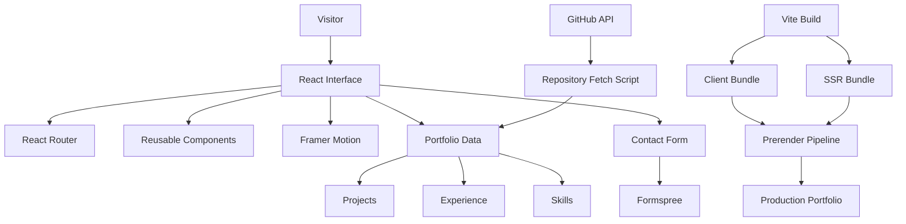

<div align="center">

# SAJIB.DEV

### A modern developer portfolio engineered as a product — not just a profile.

A fast, responsive, motion-driven portfolio built with  
**React · TypeScript · Vite · Framer Motion · Tailwind CSS**

<br/>

[](https://sajib.dev.cv/)
[](https://github.com/sajeeb-ahmeed)

<br/>

`PRODUCT THINKING` · `ENGINEERING` · `MOTION` · `PERFORMANCE`

</div>

---

## ◇ Overview

**Sajib.dev** is my personal developer portfolio and digital engineering space.

Rather than treating a portfolio as a static collection of links, this project is designed as a complete product experience — combining clean interface design, structured content, motion, dynamic GitHub data, responsive behavior, and a prerendered production build.

It represents how I approach software:

> **Clear on the surface. Thoughtful underneath.**

The site brings together my professional experience, selected projects, engineering interests, technical capabilities, and ways to connect in one focused experience.

---

## ◇ Why I Built It

A developer portfolio should do more than say:

> “Here are the technologies I know.”

It should communicate how the developer **thinks, builds, organizes, and presents software**.

This project was built around four goals:

| | Goal | Direction |
|:---:|---|---|
| `01` | **Clarity** | Make professional information easy to understand |
| `02` | **Experience** | Create a polished, responsive and engaging interface |
| `03` | **Engineering** | Use a maintainable component-based architecture |
| `04` | **Performance** | Produce an optimized, prerendered production experience |

---

## ◇ Experience

The portfolio is designed around a simple journey:

```text
DISCOVER
   │
   ▼
UNDERSTAND THE ENGINEER
   │
   ▼
EXPLORE THE WORK
   │
   ▼
SEE THE TECHNOLOGY
   │
   ▼
CONNECT
````

The objective is to remove unnecessary friction and let the work speak clearly.

---

## ◇ Core Features

### ◈ Responsive Product Experience

Built to work naturally across desktop, tablet and mobile interfaces.

### ◈ Motion-Driven Interaction

Framer Motion is used to introduce depth, transitions and movement without turning the interface into unnecessary visual noise.

### ◈ Dynamic GitHub Integration

Repository information can be fetched from GitHub during the build process, allowing project data to stay connected with my public development activity.

### ◈ Project-Driven Architecture

Portfolio content is structured around projects, experience, skills and professional information rather than being tightly coupled to individual components.

### ◈ Contact Integration

The contact experience uses Formspree, keeping the frontend lightweight while supporting direct form submissions.

### ◈ Prerendered Production Build

The production pipeline creates both the client build and an SSR bundle before prerendering the site.

This provides a stronger foundation for:

* initial page delivery
* crawlability
* metadata
* share previews
* production performance

### ◈ Type-Safe Development

TypeScript is used across the application for more predictable data structures and maintainable component contracts.

---

## ◇ Technology

<div align="center">

### FRONTEND


<br/><br/>

### TOOLING


</div>

<br/>

| Technology                   | Responsibility                             |
| ---------------------------- | ------------------------------------------ |
| **React 18**                 | Component-driven interface                 |
| **TypeScript**               | Type-safe application development          |
| **Vite**                     | Development server and production bundling |
| **React Router**             | Application routing                        |
| **Framer Motion**            | Interface animation and transitions        |
| **Tailwind CSS**             | Utility-first styling                      |
| **React Icons**              | Interface iconography                      |
| **GitHub API**               | Dynamic public repository data             |
| **Formspree**                | Contact form delivery                      |
| **SSR / Prerender Pipeline** | Production page generation                 |

---

## ◇ Architecture



---

## ◇ Source Structure

```text
developer-portfolio/
│
├── public/
│   └── static assets
│
├── scripts/
│   └── build-time utilities
│
├── src/
│   │
│   ├── components/
│   │   └── reusable UI components
│   │
│   ├── data/
│   │   └── portfolio and project data
│   │
│   ├── hooks/
│   │   └── reusable React hooks
│   │
│   ├── services/
│   │   └── external/data services
│   │
│   ├── types/
│   │   └── TypeScript definitions
│   │
│   ├── App.tsx
│   ├── entry-server.tsx
│   ├── main.tsx
│   └── index.css
│
├── .env.example
├── index.html
├── prerender.mjs
├── tailwind.config.js
├── tsconfig.json
├── vite.config.ts
└── package.json
```

---

## ◇ Build Pipeline

The production build does more than run a standard Vite compile.

```text
GitHub Repository Data
          │
          ▼
scripts/fetch-repos.mjs
          │
          ▼
TypeScript Build
          │
          ▼
Vite Client Build
          │
          ├───────────────┐
          ▼               ▼
     Client Bundle     SSR Bundle
          │               │
          └───────┬───────┘
                  ▼
             Prerender
                  │
                  ▼
        Production Output
```

The current production command:

```bash
npm run build
```

runs the repository-data fetch, TypeScript build, Vite client build, SSR build and prerendering pipeline.

---

## ◇ Local Development

### 1. Clone the repository

```bash
git clone https://github.com/sajeeb-ahmeed/developer-portfolio.git
```

### 2. Enter the project

```bash
cd developer-portfolio
```

### 3. Install dependencies

```bash
npm install
```

### 4. Configure environment variables

Create a local environment file:

```bash
cp .env.example .env
```

Then configure:

```env
VITE_GITHUB_USERNAME=sajeeb-ahmeed

VITE_FORMSPREE_ENDPOINT=https://formspree.io/f/your_form_id
```

### 5. Start development

```bash
npm run dev
```

The local Vite server will provide the development URL in the terminal.

---

## ◇ Available Commands

| Command                | Purpose                                          |
| ---------------------- | ------------------------------------------------ |
| `npm run dev`          | Start the Vite development server                |
| `npm run build`        | Run the complete production + prerender pipeline |
| `npm run build:client` | Build the client application only                |
| `npm run preview`      | Preview the production build locally             |
| `npm run lint`         | Run the configured code-quality checks           |

---

## ◇ Environment Configuration

Two public-facing configuration values are supported through environment variables.

### GitHub

```env
VITE_GITHUB_USERNAME=
```

Used for retrieving public repository information.

### Formspree

```env
VITE_FORMSPREE_ENDPOINT=
```

Used by the portfolio contact form.

> Never commit private API keys, access tokens or production secrets to the repository.

---

## ◇ Engineering Decisions

### Why React?

The portfolio contains multiple interactive sections, reusable UI patterns and dynamic experiences that benefit from a component-driven architecture.

### Why TypeScript?

Portfolio projects evolve.

TypeScript provides stronger contracts between components, services and structured project data as the application grows.

### Why Vite?

Vite provides a lightweight development environment and fast modern bundling without unnecessary framework overhead.

### Why Framer Motion?

Motion is treated as part of the product experience — used to communicate hierarchy, state and depth rather than simply adding decoration.

### Why Prerendering?

A portfolio is heavily content-driven.

Prerendering combines the flexibility of a React application with more production-friendly initial HTML output.

---

## ◇ Design Philosophy

This project follows a simple principle:

<div align="center">

### Technology should create the experience.

# It should not become the experience.

</div>

Animations, architecture and technical decisions exist to support the visitor journey.

Not to distract from it.

---

## ◇ Performance Philosophy

The project is designed around:

`Fast Loading`

`Responsive Rendering`

`Reusable Components`

`Structured Data`

`Build-Time Processing`

`Prerendered Output`

`Minimal Runtime Complexity`

The objective is not to chase complexity.

It is to deliver a portfolio that **feels immediate**.

---

## ◇ Production

The live experience is available at:

<div align="center">

# [sajib.dev.cv →](https://sajib.dev.cv/)

</div>

---

## ◇ About the Engineer

I'm **Sajib Ahmed**, a Full-Stack Software Engineer interested in the intersection of:

<div align="center">

### Engineering × Product × Design × AI

</div>

My work includes modern web applications, internal business platforms, backend systems, APIs, workflow automation and AI-integrated digital experiences.

I enjoy turning complex systems into products that feel simple to use.

---

## ◇ Repository Philosophy

This repository is intentionally public as a representation of my current frontend engineering and product presentation approach.

Some commercial systems and production projects remain private because of client confidentiality and intellectual-property requirements.

---

## ◇ License & Usage

This repository is published primarily for **portfolio, engineering reference and educational inspection**.

Unless an explicit open-source license is added, no permission is granted to redistribute, resell or present the project as your own work.

© Sajib Ahmed

---

<div align="center">

## Explore the Experience

<br/>

[](https://sajib.dev.cv/)
 
[](https://github.com/sajeeb-ahmeed)

<br/><br/>

### BUILD WITH PURPOSE.

**Make the engineering strong.
Make the experience effortless.**

<br/>

<sub>SAJIB AHMED · FULL-STACK SOFTWARE ENGINEER</sub>

</div>

